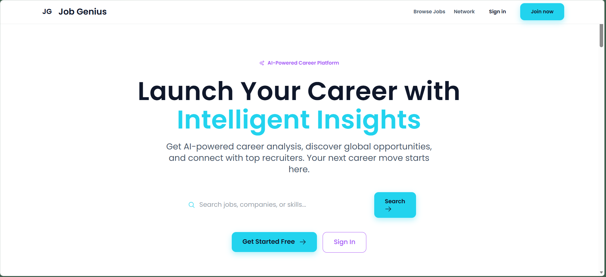
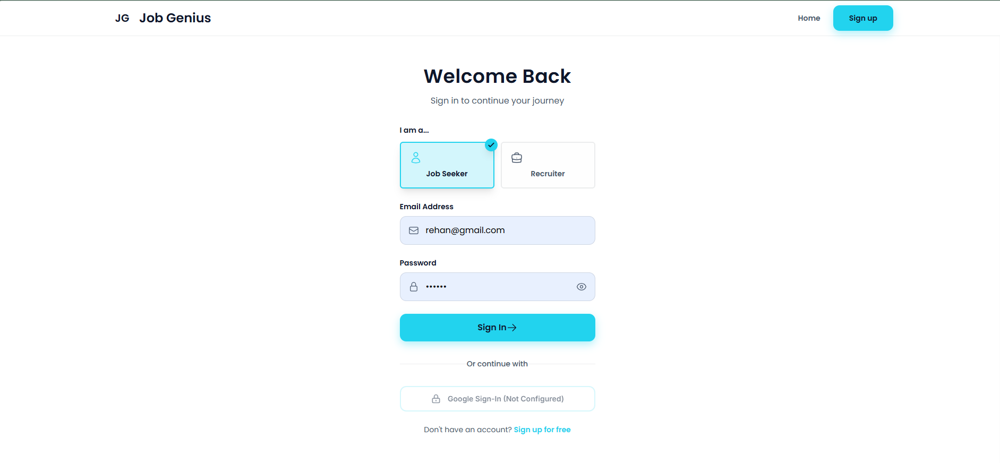
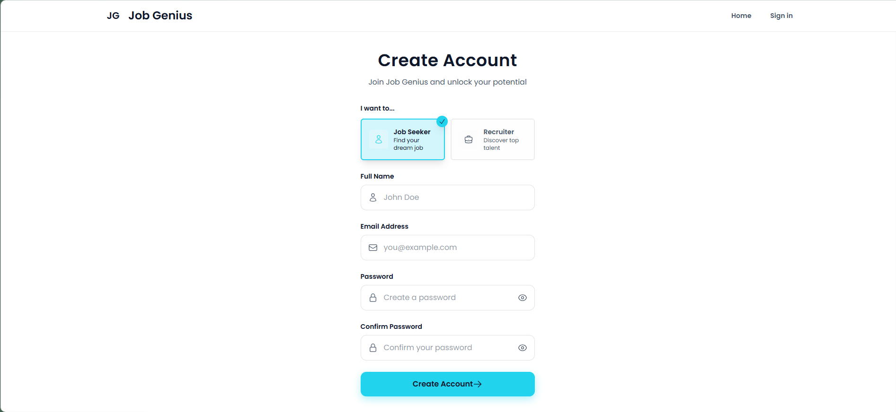
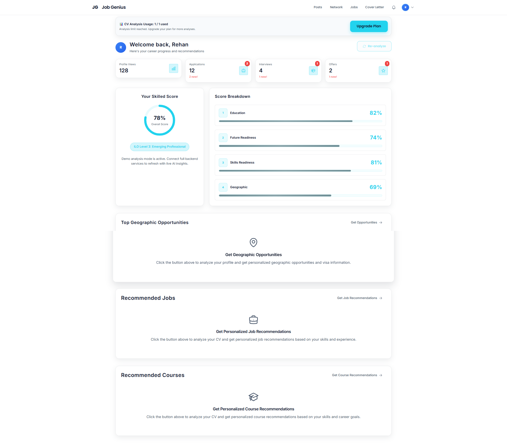
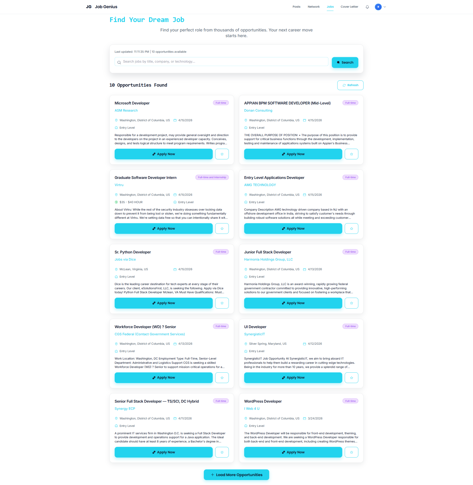
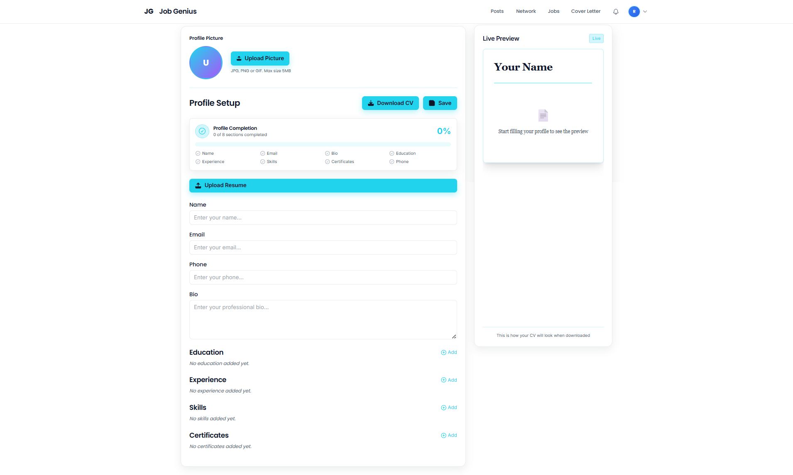
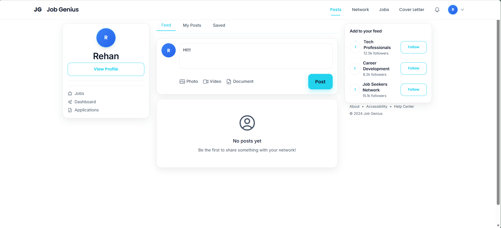
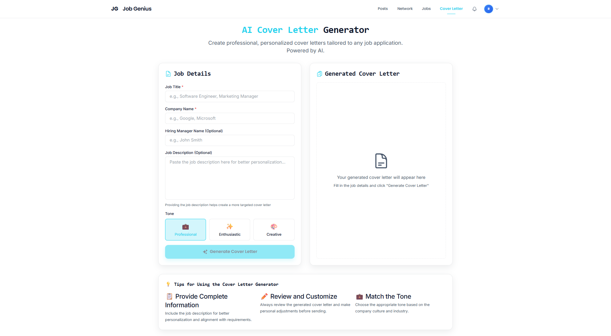
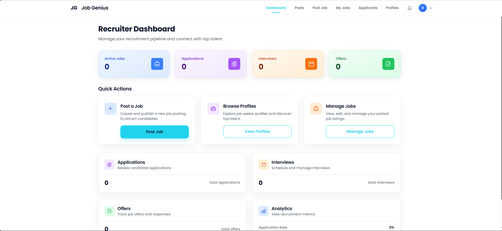
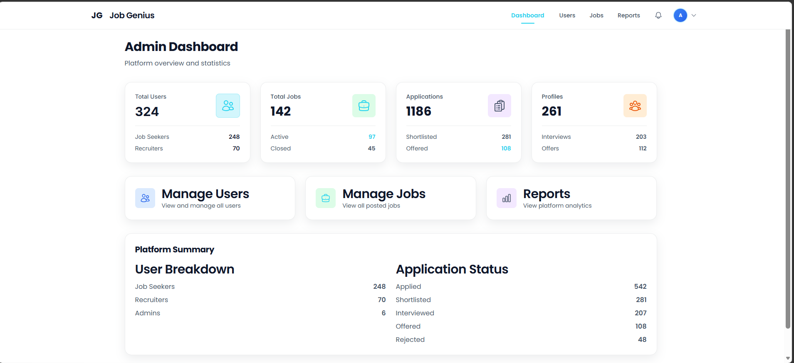

# JobGenius FYP

> **Career platform for hiring and job discovery** | Built as a full-stack final year project

[](https://react.dev)
[](https://www.typescriptlang.org)
[](https://nodejs.org)
[](https://expressjs.com)
[](https://mongodb.com)
[](https://tailwindcss.com)

## What is JobGenius?

A complete hiring and career platform that connects job seekers, recruiters, and admins in one polished system. Job seekers discover opportunities and track applications. Recruiters post jobs, review candidates, and manage the hiring pipeline. Admins oversee platform health and user engagement.

Built with production-grade tooling and a focus on **portfolio readiness**—the UI includes smart fallback content so dashboards look complete even in screenshot demos without live API dependencies.

## Core Capabilities

**For Job Seekers**  
Dashboard with profile insights, job recommendations, real-time notifications, interview tracking, and offer management.

**For Recruiters**  
Post and manage job openings, browse candidate profiles, track applications through the pipeline, schedule interviews, and send offers.

**For Admins**  
Platform-wide dashboards with user counts, job activity, application metrics, and system oversight.

**Technical Highlights**  
- Resume parsing and profile analysis powered by AI integrations
- Graceful demo modes so dashboards render beautifully even without live APIs
- Role-based access control for secure multi-tenant workflows
- Production-ready error handling and fallback content

## Tech Stack

| Layer | Tech |
| --- | --- |
| **Frontend** | React 18, TypeScript, Vite, Tailwind CSS, Framer Motion, React Router |
| **Backend** | Node.js, Express.js, MongoDB, PostgreSQL, Mongoose, JWT, bcryptjs |
| **UI & UX** | Lucide React, Heroicons, Recharts, GSAP animations |
| **Integrations** | OpenAI API, Google authentication, PDF/DOCX processing |

## Screenshots

Tour the app in pictures. All images are organized in the [screenshots](screenshots) folder.

### Landing & Authentication

| Landing page | Login page | Signup page |
| --- | --- | --- |
|  |  |  |

### Job Seeker Experience

| Dashboard | Jobs | Profile |
| --- | --- | --- |
|  |  |  |

| Posts | Cover letter |
| --- | --- |
|  |  |

### Recruiter and Admin

| Recruiter dashboard | Admin dashboard |
| --- | --- |
|  |  |

## Project Structure

```
JobGenius-FYP/
├── backend/              # Express API, controllers, routes, database
├── src/                  # React frontend (components, pages, services)
├── screenshots/          # Portfolio gallery images
├── package.json          # Frontend dependencies
└── vite.config.ts        # Frontend build config
```

## Get Started

### Prerequisites

- **Node.js** 18+
- **MongoDB** connection string (local or MongoDB Atlas)
- **PostgreSQL** (optional, for recruiter features)

### Installation

```bash
# Install frontend dependencies
npm install

# Install backend dependencies
cd backend
npm install
```

### Configuration

1. Create `backend/.env` from `backend/.env.example`
2. Add your MongoDB URI and JWT secret
3. Add optional API keys for OpenAI, Google OAuth, etc.

### Run Locally

**Terminal 1 – Backend:**
```bash
cd backend
npm run dev
# Runs on http://localhost:5000
```

**Terminal 2 – Frontend:**
```bash
npm run dev
# Runs on http://localhost:5173
```

### Next Steps

- Review [SETUP_GUIDE.md](SETUP_GUIDE.md) for detailed setup help
- Check [backend/.env.example](backend/.env.example) for all available configuration options

## Why JobGenius

✨ **Complete hiring workflow**, not a demo—includes job seeker dashboards, recruiter pipelines, and admin oversight  
🎨 **Portfolio-ready** with smart fallback data so screenshots look complete without live API dependencies  
🔒 **Security-first** with environment-based configuration and no hardcoded secrets  
⚡ **Production patterns** like role-based access, graceful error handling, and modern UI animations  

## Security

Sensitive credentials are never committed to the repository. All API keys, database URIs, and secrets are configured through environment variables on a per-deployment basis.

## Ready to Explore?

JobGenius demonstrates a full-stack hiring platform with separate experiences for job seekers, recruiters, and admins—built to look polished in portfolio presentations and designed for easy local development and deployment.
